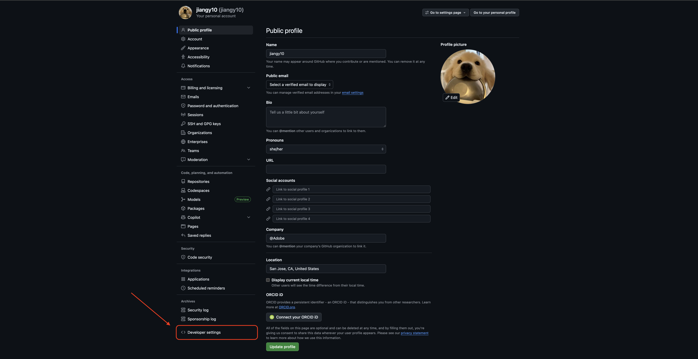
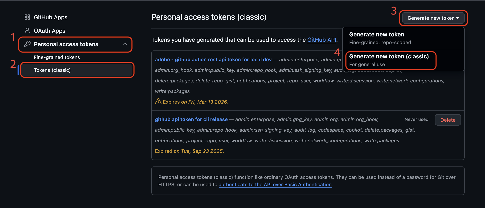

# update-bot

Push the same file updates to multiple GitHub repos in one run. The bot creates a branch, commits the changes, and opens a PR on each target repo.

## Setup

1. Install dependencies:
  ```bash
   npm install
  ```
2. Create a `.env` file with your GitHub token (use `.env.example` as reference):
  ```
   GITHUB_TOKEN=ghp_your_token_here
  ```
   The token needs **repo** scope (read/write access to code and pull requests).

> 💡How to generate a GitHub token:  
> 1. Navigate to Settings page from github profile tab
> 
> 2. Select Developer Settings from the left Navbar
> 
> 3. Select Personal access tokens -> Tokens(classic) -> Generate new token -> Generate new token (classic)
> 
> 4. Grant repo and workflow access to the token
> 
> 5. Generate token
> 5. Save the token somewhere

## Configuration

### `repos.json` — target repositories

An array of repos the bot will push updates to.


| Field           | Type    | Required | Description                                                       |
| --------------- | ------- | -------- | ----------------------------------------------------------------- |
| `owner`         | string  | Yes      | GitHub org or user (e.g. `"AdobeDocs"`)                           |
| `repo`          | string  | Yes      | Repository name                                                   |
| `ownerRequired` | boolean | No       | Force the PR to note that owner review is required. If omitted, auto-detected: `true` when any file in the PR overwrites an existing file, `false` when all files are new additions or deletions. |


```json
[
  {
    "owner": "AdobeDocs",
    "repo": "dev-docs-template"
  }
]
```

> **Tip — generate `repos.json` from a spreadsheet:** Copy the **Repo** column from the *DevDocs Migration* sheet (public repos) or the **Source** column from the *DevDocs Private Repos Migration* sheet (private repos) in the [migration spreadsheet](https://adobe-my.sharepoint.com/:x:/p/pahyde/EYST_p2xpxJKhHe7VJ7_KTIB6D8TC-vqMtt3F3zo9wMIRw?e=UvYFdF), then paste into an AI agent with this prompt:
>
> ```
> Convert these GitHub URLs into a JSON array and write the result to repos.json: [{ "owner": "...", "repo": "..." }]
>
> <paste column here>
> ```

### `file-mappings.json` — files and their paths

An array of entries that describe files to add or delete in the target repos. Each entry supports two actions: **add** (default) to push a file, and **delete** to remove one.

For `add` entries, `path` is the file path in the source template repo ([AdobeDocs/dev-docs-template](https://github.com/AdobeDocs/dev-docs-template)). By default the file is written to the same path in the target repo. Use `destPath` to write it to a different path — useful for private repos where workflow files have different names than their public equivalents.

| Field      | Type   | Required           | Description                                                                                      |
| ---------- | ------ | ------------------ | ------------------------------------------------------------------------------------------------ |
| `action`   | string | No (default `add`) | `"add"` to create/update a file, `"delete"` to remove it                                        |
| `path`     | string | Yes                | Source file path in the template repo (for `add`) and target path in the target repo (for both) |
| `destPath` | string | No                 | Destination path in the target repo. Only valid for `add`. If omitted, defaults to `path`.      |

#### Adding a file

Set `action` to `"add"` (or omit it) and provide `path`. The file is fetched from `dev-docs-template` at the given path and created or overwritten in each target repo.

```json
{
  "action": "add",
  "path": ".github/workflows/lint.yml"
}
```

#### Adding a file with a different destination path

Use `destPath` when the file needs to land at a different path in the target repo than it has in the template. This is needed for private repos, where the `-private` workflow variants must be renamed on copy.

> **Tip — public vs. private repos:** Repos under the `AdobeDocs` org are public and use workflow files with the same names as the template, so `destPath` is never needed. Repos under `AdobeDocsPrivate` are private — workflows shared with public repos (e.g., `lint.yml`) are added as-is, but deploy/stage/build workflows have `-private` variants in `dev-docs-template` (e.g., `deploy-private.yml`) that must be installed under the standard names (e.g., `deploy.yml`) — always pair those with `destPath`. This matches how public and private repos are configured in the [New EDS Repo](https://wiki.corp.adobe.com/spaces/AdobeCloudPlatform/pages/3547041099/Converting+and+Onboarding+to+EDS#ConvertingandOnboardingtoEDS--382725667) setup steps.

```json
{
  "action": "add",
  "path": ".github/workflows/deploy-private.yml",
  "destPath": ".github/workflows/deploy.yml"
}
```

#### Deleting a file

Set `action` to `"delete"` and provide `path`. If the file does not exist in the target repo, the deletion is skipped with a warning.

```json
{
  "action": "delete",
  "path": "dev.mjs"
}
```

#### Full example (private repo workflow cleanup)

```json
[
  {
    "action": "add",
    "path": ".github/workflows/lint.yml"
  },
  {
    "action": "delete",
    "path": ".github/workflows/deploy.yml"
  },
  {
    "action": "delete",
    "path": ".github/workflows/stage.yml"
  },
  {
    "action": "delete",
    "path": ".github/workflows/build-auto-generated-files.yml"
  },
  {
    "action": "add",
    "path": ".github/workflows/deploy-private.yml",
    "destPath": ".github/workflows/deploy.yml"
  },
  {
    "action": "add",
    "path": ".github/workflows/stage-private.yml",
    "destPath": ".github/workflows/stage.yml"
  },
  {
    "action": "add",
    "path": ".github/workflows/build-auto-generated-files-private.yml",
    "destPath": ".github/workflows/build-auto-generated-files.yml"
  }
]
```

## Usage

1. Edit `file-mappings.json` to list the file paths to sync from [dev-docs-template](https://github.com/AdobeDocs/dev-docs-template).
2. Edit `repos.json` to list the target repos.
3. Run:
  ```bash
   npm start
  ```

The bot will:

- Validate configuration and that every repo in `repos.json` is accessible with the provided token. The bot aborts if any check fails.
- Fetch each `add` file from the [AdobeDocs/dev-docs-template](https://github.com/AdobeDocs/dev-docs-template) repo on GitHub.
- For each target repo, check if a branch called `auto-content-update` already exists. If it does, the bot commits on top of it; otherwise a new branch is created from `main`.
- Compare the resulting tree with the current branch state. If all files already match the template content, no commit is created and the repo is reported as skipped.
- Check if an open pull request from `auto-content-update` into `main` already exists. If so, the bot skips PR creation and reports the repo as "PR updated"; otherwise a new PR is opened.
- Print a summary grouped by PR created, PR updated, skipped, warnings, and failures.

## Fixing PRs

When the bot overwrites repo-specific fields — for example `name`, `repository`, or `scripts` in `package.json` — use the included [Cursor rules](.cursor/rules/) to correct the PRs with an AI coding agent.

Paste the following prompt into Cursor or Claude Code, substituting your actual PR URLs and the files that need fixing:

```
Read .cursor/rules/pr-fixer.mdc and .cursor/rules/update-bot-pr-policy.mdc, then fix these PRs:
- AdobeDocs/example-repo: https://github.com/AdobeDocs/example-repo/pull/123

Files to fix:
- package.json
- .gitignore
```

The agent fetches each PR's diff, applies the [fix policy](.cursor/rules/update-bot-pr-policy.mdc) to preserve repo-specific values, and pushes corrected commits to the PR branch.